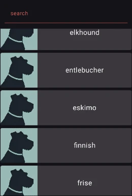
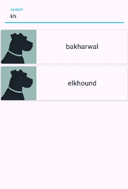
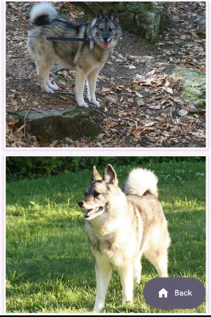

# DogsApp

DogsApp es una aplicación móvil desarrollada en Kotlin, que permite explorar diferentes razas de perros:

## Funcionalidades
- Lista razas, obtenida desde la [dog-api](https://dog.ceo/dog-api/).
- Pantalla de detalles para la carga de fotografías de cada raza.
- Arquitectura basada en **MVVM**.
- Inyección de dependencias mediante **Dagger Hilt**.
- Llamada a la API usando **Retrofit**.
- Navegación basada en **Jetpack Compose Navigation**.
- Dark theme.

## Arquitectura
El proyecto sigue el patrón de arquitectura MVVM:
- **Model**: Gestión de los datos y la lógica de negocio.
- **ViewModel**: Manejo de los estados de UI y side-effects.
- **View**: Interfaz de usuario creada con Jetpack Compose.

## Capturas de Pantalla

    
    
    

